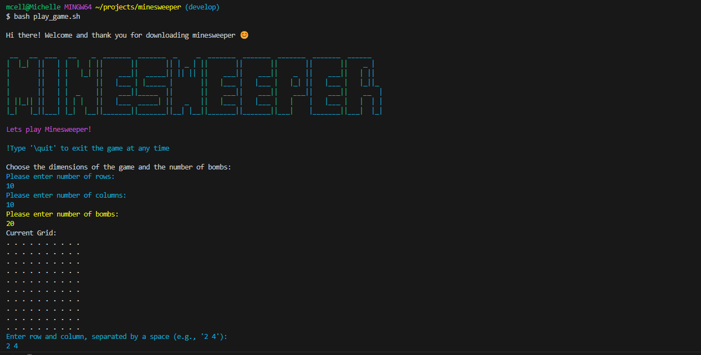

# MineSweeper Terminal App 	&#128163;&#128165;

A simplified version of Minesweeper run on the command line and written using Java.



## How to Play: 

#### 1. Open Terminal <!-- omit in toc -->
In your terminal window, check that you have java installed. You can do this by running:
```bash
java --version
```

If java is not installed, you can follow the installation guide [here](https://www.java.com/en/download/help/download_options.html)
 
 
#### 2. Download the game

Copy and paste the following to your terminal: 
```bash
git clone git@github.com:mcelle888/minesweeper.git
```

#### 3. CD into the file  
```bash
cd minesweeper
```

#### 4. Run the following command in ther terminal to run the game:  
```bash
bash play_game.sh
```

## Game Features
- Interactive menu to choose dimensions of the grid and number of bombs in a game
- Squares are selected using co-ordinate inputs
- Displays 0-8 to show how many mines surround the location
- Game ends when user finds all non-mines or when user selects a mine
- Clicking an empty square reveals squares around if they are empty (cascade into the surrounding empty squares)

## Future Additions/Improvements
- Ability to track wins and losses

## TechStack

Java | Bash